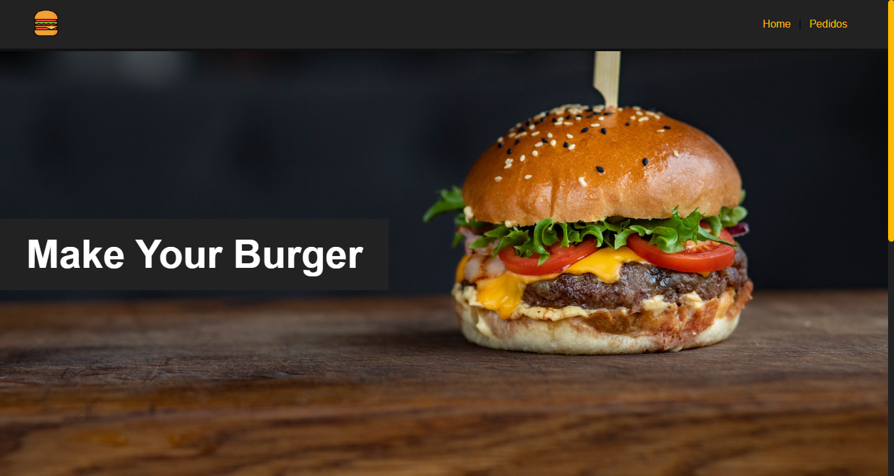

<h1 align="center"> 
    Make-Your-Burger
</h1>
<p align="center">
  <a href="#-About">About</a>&nbsp;&nbsp;&nbsp;|&nbsp;&nbsp;&nbsp;
  <a href="#-Technologies">Technologies</a>&nbsp;&nbsp;&nbsp;|&nbsp;&nbsp;&nbsp;
  <a href="#-How to run">How to run</a>
</p>
<p align="center">
    
</p>

<h5 style="text-align: center"> Thank you for see !</h5>


## 📚 Sobre

Olá, espero que estejam bem! Esse projeto é voltado para rede de fastfood, foi utilizado como fonte de estudo o _Youtube_  com o canal: _Matheus Battisti_, além da documentação do `**Vue.js**`. Com esse projeto é um app que nos permite montar o nosso burger, temos opção a opção de mudar de página `(rota)`, se observarmos algumas partes do layout se repete isso se deve pelo reaproveitamento de alguns componentes, em baixo do banner estático teremos um formulário do projeto que é responsável pela criação dos pedidos, nesse projeto vamos trabalhar o `front-end` separado do `back-end` com uma `API fake`.

Assim que criarmos o pedido é mostrado para nós uma mensagem do `flash-mesage` do pedido criado, na rota 'Pedidos', podemos atualizar o estado dos pedidos criado, ao recarregar a página os dados persistem no `back-end`, teremos também a opção de cancelar pedidos.

Nesse projeto trabalhamos com `Query` de select para trazer os dados do select não sendo o fixo mas sim do `Banco de Dados` como se estivesse cadastrado em uma tabela..

Para ter acesso a conteúdo similares, acesse: [Matheus Battisti](https://www.youtube.com/@MatheusBattisti)

## 🧪 Tecnologias

Esse projeto foi desenvolvido com as seguintes tecnologias:

- [HTML](https://developer.mozilla.org/en-US/docs/Web/HTML)
- [CSS](https://developer.mozilla.org/en-US/docs/Web/CSS)
- [Node.js](https://nodejs.org/en)
- [Vue.js](https://vuejs.org/)

## 🚀 Como executar

Clone o projeto e acesse a pasta e instale as dependências.

```bash
$ git clone https://github.com/arthursj/Make-Your-Burger.git
$ cd make_your_burger
$ npm install
```

Para iniciá-lo, siga o passo abaixo:
```bash
# Inicie o projeto
$ npm run serve
```
O app estará disponível no seu browser pelo endereço http://localhost:8080.

```bash
# Inicie o backend
$ npm run backend
```

Caso precise do endereço do backend estará disponível no endereço http://localhost:3000.

## 📚 About

Hello, I hope you are all well! This project is aimed at a fast food chain. The source of this study was _YouTube_ with the channel: _Matheus Battisti_, in addition to the `**Vue.js**` documentation. This project is an app that allows us to assemble our burger. We have the option to change pages `(route)`. If we observe that some parts of the layout are repeated, this is due to the reuse of some components. Below the static banner, we will have a project form that is responsible for creating orders. In this project, we will work on the `front-end` separately from the `back-end` with a `fake API`.

As soon as we create the order, a `flash-message` message of the created order is shown to us. In the 'Orders' route, we can update the status of the created orders. When reloading the page, the data persists in the `back-end`. We will also have the option to cancel orders.

In this project, we work with a select `Query` to bring the select data, not being fixed but from the `Database` as if it were registered in a table.

To access similar content, visit: [Matheus Battisti](https://www.youtube.com/@MatheusBattisti)

## 🧪 Technologies

This project was developed with the following technologies:

- [HTML](https://developer.mozilla.org/en-US/docs/Web/HTML)
- [CSS](https://developer.mozilla.org/en-US/docs/Web/CSS)
- [Node.js](https://nodejs.org/en)
- [Vue.js](https://vuejs.org/)

## 🚀 How to run

Clone the project and access the folder and install the dependencies.

```bash
$ git clone https://github.com/arthursj/Make-Your-Burger.git
$ cd make_your_burger
$ npm install
```

To start it, follow the step below:
```bash
# Start the project
$ npm run serve
```
The app will be available in your browser at http://localhost:8080.

```bash
# Start the backend
$ npm run backend
```

If you need the backend address, it will be available at http://localhost:3000.


--------------

Developed by :atom_symbol: [**Arthur Silva**]([arthursj (ArthurSilva) (github.com)](https://github.com/arthursj))
